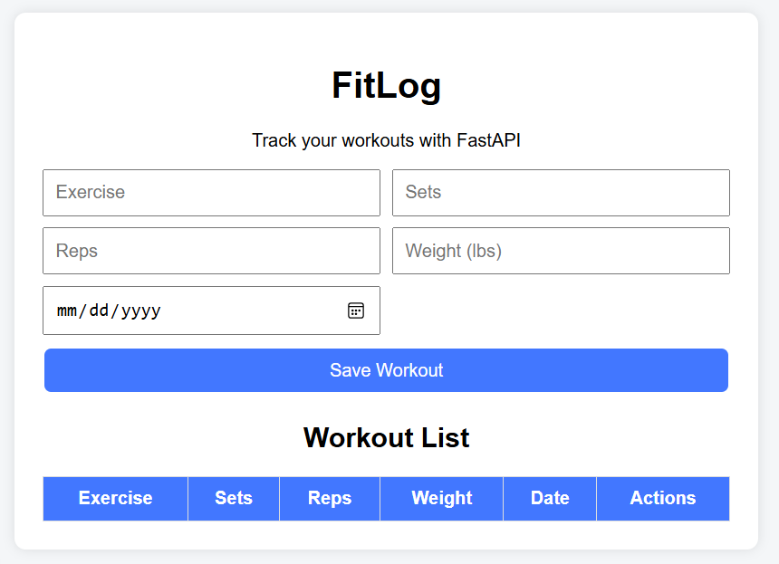
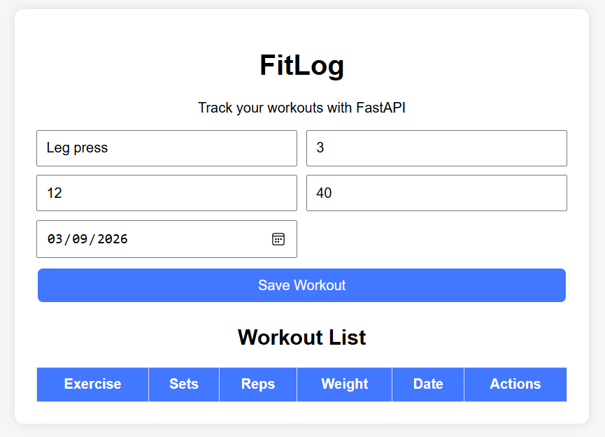
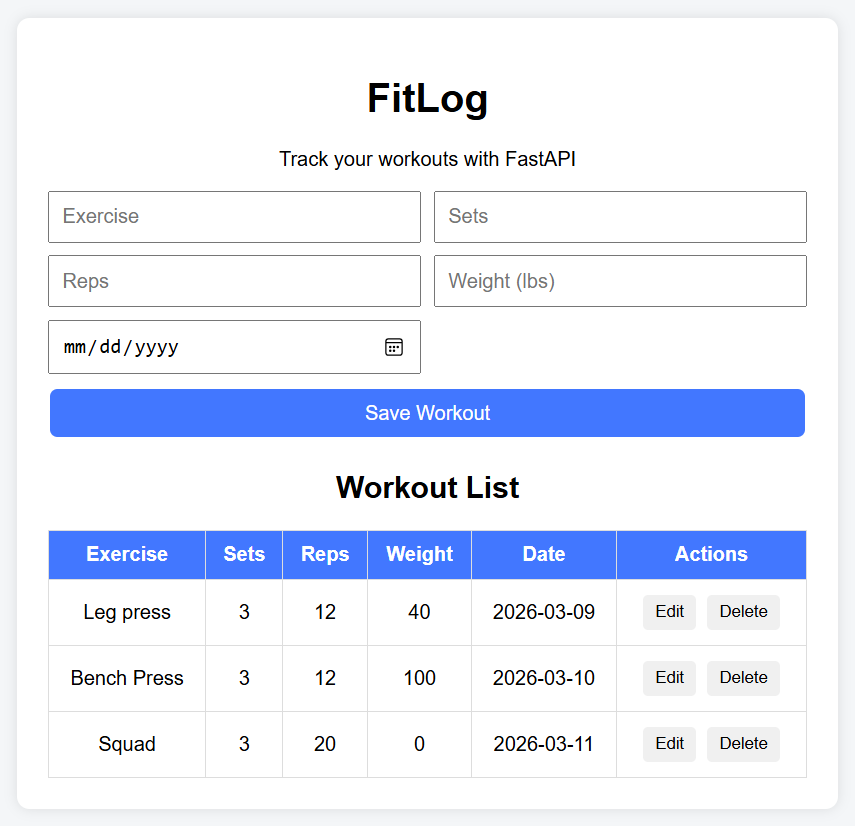
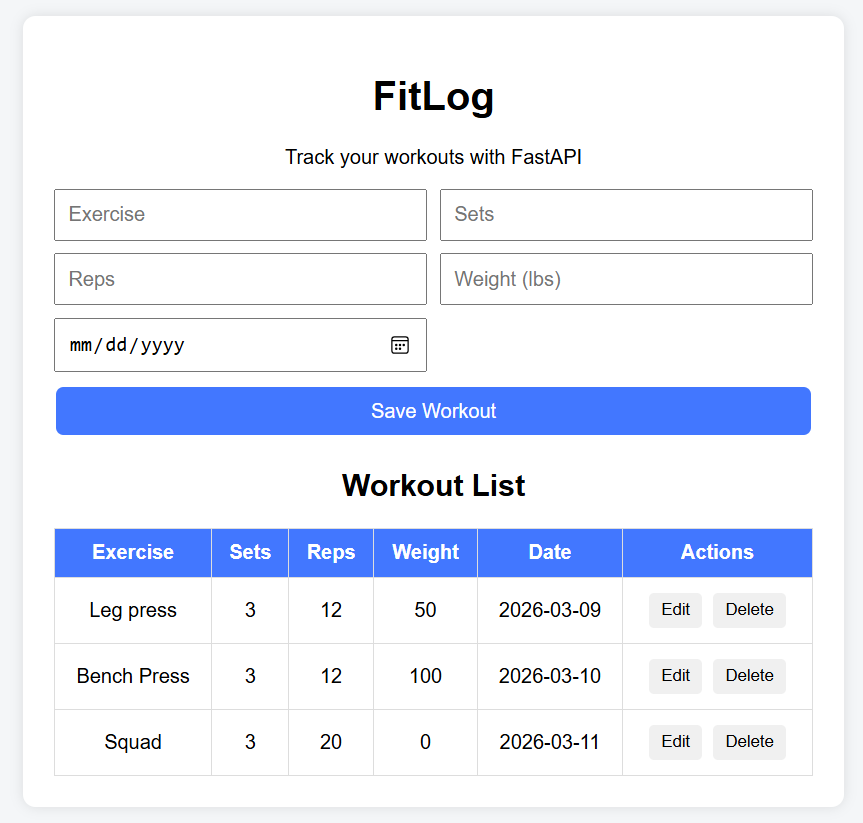

# FitLog

FitLog is a simple workout logging web application built using **FastAPI, HTML, CSS, and JavaScript**.  
The application allows users to track their workouts by creating, viewing, updating, and deleting workout entries.

This project demonstrates a basic **CRUD (Create, Read, Update, Delete)** web application with a FastAPI backend and a simple frontend interface.

---

# Features

- Add new workout entries
- View a list of all workouts
- Edit existing workouts
- Delete workouts
- Clean and simple user interface

All workout data is stored in an **in-memory Python list**, which makes the application lightweight and easy to run locally.

---

# Technologies Used

- Python
- FastAPI
- Uvicorn
- HTML
- CSS
- JavaScript
- Git & GitHub
- Visual Studio Code

---

# Project Structure
```
fitlog-fastapi/
│
├── main.py
├── requirements.txt
├── README.md
│
├── templates/
│ └── index.html
│
├── static/
│ ├── script.js
│ └── style.css
│
└── screenshots/
├── home.png
├── add-workout.png
├── workout-list.png
└── edit-workout.png
```

---

# How to Run the Application

### 1. Clone the repository
git clone https://github.com/YOUR_USERNAME/fitlog-fastapi.git
### 2. Navigate to the project folder
cd fitlog-fastapi
### 3. Create a virtual environment
python -m venv venv
### 4. Activate the virtual environment
venv\Scripts\activate
### 5. Install dependencie
pip install -r requirements.txt
### 6. Run the FastAPI server
uvicorn main:app --reload
### 7. Open the application
Open this address in your browser:
http://127.0.0.1:8000

---

# API Endpoints

| Method | Endpoint | Description |
|------|------|------|
| GET | /workouts | Retrieve all workouts |
| POST | /workouts | Create a new workout |
| PUT | /workouts/{id} | Update an existing workout |
| DELETE | /workouts/{id} | Delete a workout |

---

# Screenshots

## Home Page

Shows the main interface where users can input workout information.



---

## Adding a Workout

Users can enter exercise information such as exercise name, sets, reps, weight, and date, then save the workout.

Example entry:

- Exercise: Leg Press  
- Sets: 3  
- Reps: 12  
- Weight: 40 lbs  
- Date: 2026-03-09  



---

## Workout List

After saving a workout, it appears in the workout table where all entries are displayed.



---

## Editing a Workout

Users can modify an existing workout entry.  
In this example, the **Leg Press weight was updated from 40 lbs to 50 lbs** using the Edit button.



---

# Author

**Chun Hang (Henry) Chan**  
University of Iowa  
Geoinformatics Program

---

# Notes

This project was created as part of a FastAPI web application assignment to demonstrate backend API development combined with a simple frontend interface.